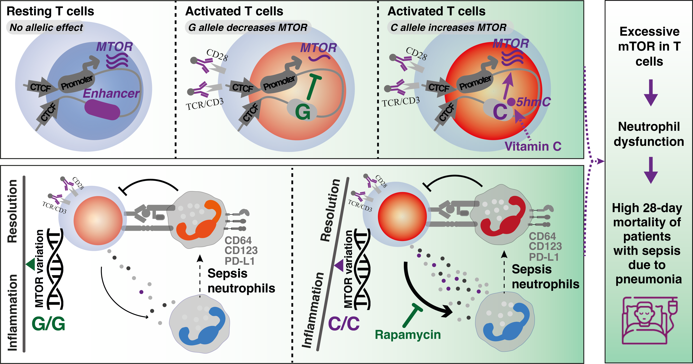

# MTOR-Genetics-Project

## Context-specific regulatory genetic variation in MTOR dampens Neutrophil-T cell crosstalk in sepsis, modulating disease

### 
We identify a variant-containing enhancer that regulates MTOR transcription in resting T cells. Our findings are consistent with this enhancer sustaining essential baseline mTOR activity in cells while masking the MTOR eQTL effect. Upon T-cell receptor activation, mTOR is highly upregulated through post-translational modifications, with silencing of this enhancer providing a negative feedback loop to prevent excessive mTOR activity at the transcription level. In activated T cells, the eQTL effect is exposed through hydroxymethylation involving the variant which can be manipulated by Vitamin C via activation of TET enzymes. The C allele triggers aberrant mTOR signaling and T cell activity during sepsis, ultimately leading to neutrophil dysfunction and increased sepsis mortality in individuals with this genetic variant.
