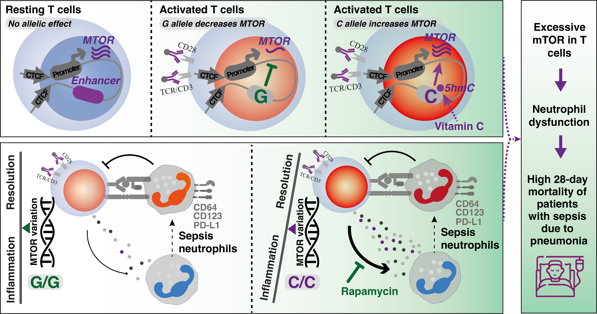

# MTOR-Genetics-Project
#### _P. Zhang et al., Context-specific regulatory genetic variation in MTOR dampens Neutrophil-T cell crosstalk in sepsis, modulating disease. (2025)_

### 
We identify a variant-containing enhancer that regulates MTOR transcription in resting T cells. Our findings are consistent with this enhancer sustaining essential baseline mTOR activity in cells while masking the MTOR eQTL effect. Upon T-cell receptor activation, mTOR is highly upregulated through post-translational modifications, with silencing of this enhancer providing a negative feedback loop to prevent excessive mTOR activity at the transcription level. In activated T cells, the eQTL effect is exposed through hydroxymethylation involving the variant which can be manipulated by Vitamin C via activation of TET enzymes. The C allele triggers aberrant mTOR signaling and T cell activity during sepsis, ultimately leading to neutrophil dysfunction and increased sepsis mortality in individuals with this genetic variant.

## Source of data:
- Genomic Advances in Sepsis (GAinS) [whole blood gene expression](https://ega-archive.org/datasets/EGAD00001008730) and [genotyping](https://ega-archive.org/datasets/EGAD00001015369) data.
- ATAC-seq data from human primary immune cells including [macrophages](https://www.ncbi.nlm.nih.gov/geo/query/acc.cgi?acc=GSE172116) | [monocytes](https://zenodo.org/record/8158923) | [neutrophils](https://www.ncbi.nlm.nih.gov/geo/query/acc.cgi?acc=GSE150018) | [NK and dendritic cells](https://www.ncbi.nlm.nih.gov/geo/query/acc.cgi?acc=GSE118189) | [CAR T cells](https://www.ncbi.nlm.nih.gov/geo/query/acc.cgi?acc=GSE168882).
- RNA-seq data in primary CD4+ or CD8+ T cells treated with anti-CD3/CD28 Dynabeads and mTOR inhibitor [Rapamycin](https://www.ncbi.nlm.nih.gov/geo/query/acc.cgi?acc=GSE129829).
- MeDIP-Seq for [5hmC](https://www.ncbi.nlm.nih.gov/geo/query/acc.cgi?acc=GSE74850) in CD4+ T cells.
- Histone modification ChIP-seq and CTCF ChIP-seq/ChIA-PET from the [ENCODE](https://www.encodeproject.org/) project.
- Sepsis whole blood [scRNA-seq](https://zenodo.org/records/7924238) data.
- Genotype data from the [UK Biobank](https://www.ukbiobank.ac.uk/) for individuals with confirmed bacterial pneumonia.
- Genotype data from the [1000 Genomes Project](http://ftp.1000genomes.ebi.ac.uk/vol1/ftp/data_collections/1000_genomes_project/release/). 
- [The eQTL Catalogue](https://www.ebi.ac.uk/eqtl/) - Expression Quantitative trait loci (eQTL) recomputed from public datasets derived from 75 tissues/cell types and 14 treatments.
- Type 2 diabetes GWAS summary statistics - [dataset1](https://www.diagram-consortium.org/downloads.html) and [dataset2](https://ftp.ncbi.nlm.nih.gov/dbgap/studies/phs001672/analyses/)
